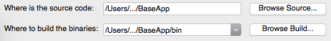
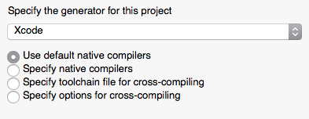
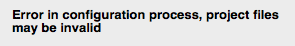
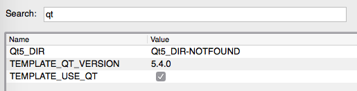
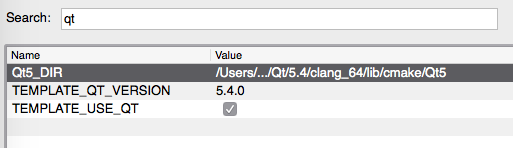
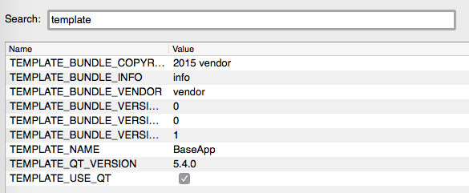
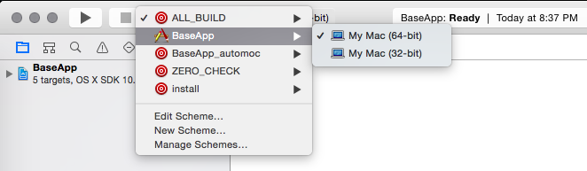
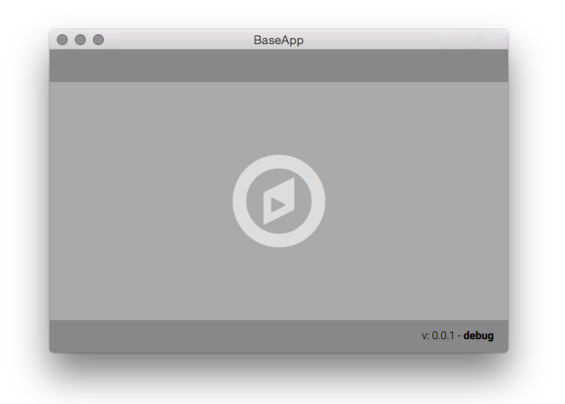

QML Application Template - Setup
===

###1. Downlaod and install prerequisites

- Download and install [Qt5](https://www.qt.io/download-open-source/)
- Downlaod and install [CMake](http://www.cmake.org/download/)

###2. Configure using CMake GUI

- Start CMake and set the project source and binary directories:

	

- Select Xcode

	

- Press *Configure* (...and probably receive an error)
 
	
	
	This happens only if CMake is not able to locate the Qt installation
	
- Fixing the above error: First type 'qt' in the search to filter values

	
	
- Set the path to **Qt5_DIR** (.../Qt/Qt5.4/clang_64_lib/cmake/Qt5):

	
	
- Press *Configure*
	
- Specify project settings as you want (all prefixed with **TEMPLATE_**)

	

- Press *Configure* again

- Press *Generate*

###3. Build and run

- Open the generated .xcodeproj file with Xcode

- Switch to the application target

	
	
- Run the app

	
